<p align="center">
  <h1 align="center">TribeWatch</h1>
  <p align="center"><strong>The tribe management toolkit for ARK: Survival Ascended</strong></p>
  <p align="center">
    Discord alerts &bull; Web dashboard &bull; Raid timelines &bull; Member tracking &bull; Generator reminders &bull; Todo lists &bull; Calendar
  </p>
</p>

---

TribeWatch monitors your ARK tribe log by reading what's on screen - just like you do, but 24/7 so long as the tribe log is open. It captures a screenshot of your tribe log every 2 seconds, reads the text with OCR, figures out what happened, and tells your Discord about things that matter (not spamming every entry). Meanwhile, the web dashboard gives your whole tribe a shared command center with real-time updates, to-do lists, task assignments, raid timelines, calendar events, member activity tracking, and everything you need to run a tribe properly.

**100% BattlEye safe.** TribeWatch reads screen pixels — the same thing OBS or a screenshot tool does. No memory reading, no DLLs, no mods, no admin access needed.

---

## Discord Alerts

Get notified instantly when something happens to your tribe. TribeWatch detects **30+ event types** from the tribe log and sends color-coded Discord embeds to your webhook channels.

<p align="center">
  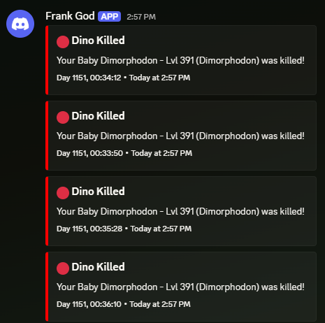
  &nbsp;&nbsp;
  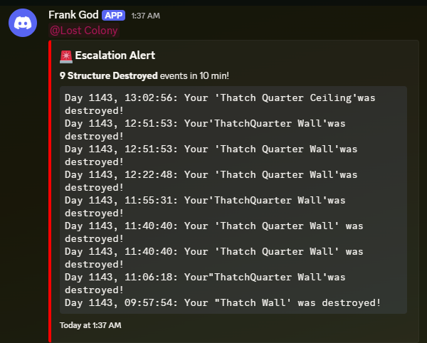
</p>

- **Critical events send immediately** — structures destroyed, dinos killed, tribe members killed, anti-mesh, parasaur detection
- **Routine events batch together** — tames, demolitions, cryopods, uploads — sent every 15 seconds in one embed instead of spamming
- **Escalation alerts** — "9 Structure Destroyed events in 10 min!" with a full event log when the same thing keeps happening
- **Personal pings** — link your tribe members' Discord IDs so the right person gets `@mentioned` when they get killed
- **Role pings** — ping your tribe's Discord role on critical events, with per-event overrides (e.g. ping `@here` for structures with "vault" or "turret" in the name)
- **Multiple webhook channels** — separate webhooks for general alerts, raids, debug logging, and task/calendar notifications
- **Rate limit handling** — respects Discord's rate limits with retry queuing, never drops alerts
- **Fully customisable per event type** — every event type can be independently configured: send to Discord or not, ping or not, who to ping, severity override, and escalation thresholds (e.g. only alert after 4+ structures destroyed in 10 minutes). Text-based conditions let you set different rules for "vault" vs "turret" vs "generator" structures — all from the web UI

### Monitoring Status Alerts

TribeWatch tells you when something's wrong with monitoring itself — if it goes idle (tribe log not visible for 10+ minutes), you'll get a warning embed, and a recovery embed when it comes back.

<p align="center">
  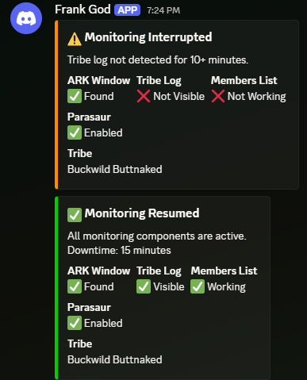
</p>

---

## Web Dashboard

A real-time web interface shared by your whole tribe. Everything updates live over WebSocket — no page refreshing.

<p align="center">
  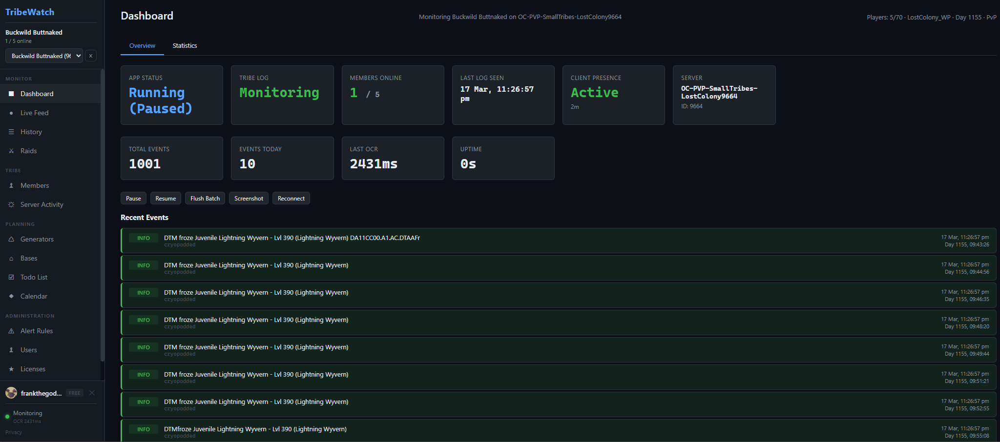
</p>

The dashboard shows monitoring status, online member count, total events, OCR latency, server info (player count, map, day/time via EOS), and a live event feed. Control buttons let you pause/resume monitoring, flush batched events, take a screenshot, or trigger a reconnect — all from the web UI.

---

## What TribeWatch Detects

TribeWatch parses **30+ event types** from tribe log text with OCR-tolerant regex patterns that handle common misreads (`Day` → `0ay`, `Lvl` → `Lv1`, curly quotes, en-dashes, accented characters).

| Category | Events |
|----------|--------|
| **Raid / PvP** | Structure destroyed, dino killed, tribe member killed, anti-meshed, parasaur enemy detection |
| **Tribe kills** | Your dinos killed enemy dinos, your tribe killed enemy players, your tribe destroyed enemy structures |
| **Taming & Breeding** | Dino tamed, egg hatched, claimed, unclaimed |
| **Cryopod** | Cryopodded, released from cryopod |
| **Transfers** | Uploaded, downloaded |
| **Tribe roster** | Player added, player removed, player promoted, player demoted, rank group changed |
| **Decay & Loss** | Auto-decay destroyed, dino starved |
| **Demolition** | Player demolished a structure |
| **Server joins** | Non-tribemate joined the server (from join/leave notifications) |
| **Parasaur** | Sustained enemy player detection, enemy babies detection, brief flashes |

Every event type has a default severity (critical / warning / info) that you can override per-event in the alert rules.

---

## Searchable Event History

Every event is stored with full metadata — severity, timestamp, in-game day/time, event type, and raw text. Filter by severity, type, text search, or day range.

<p align="center">
  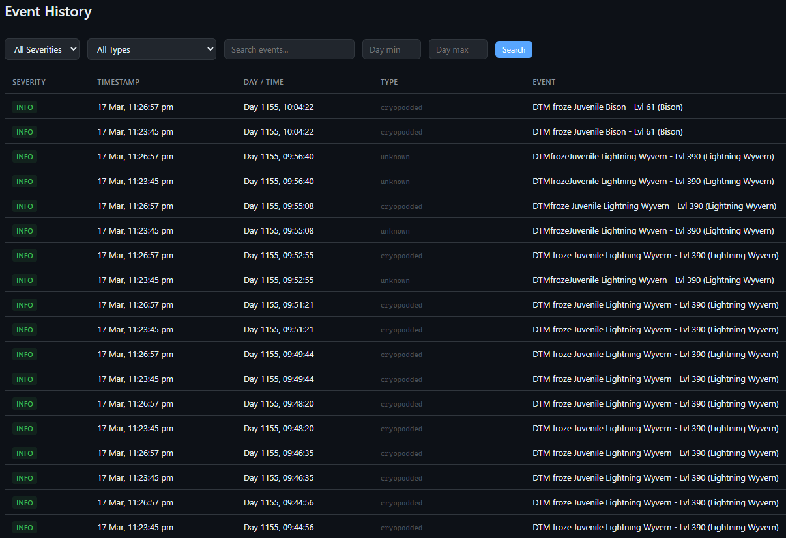
</p>

---

## Raid Timeline

Combat events are automatically clustered into raid incidents based on timing. See a density chart of what happened and when, expandable incident cards with full event details, and summary counts (structures destroyed, dinos killed, members killed).

<p align="center">
  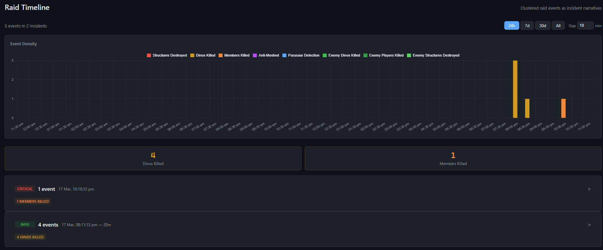
</p>

- Configurable gap threshold — events within 10 minutes are grouped into the same incident
- Time range filters (24h, 7d, 30d, all)
- Color-coded by event type: structures destroyed (red), dinos killed (yellow), members killed (orange), anti-meshed (purple), parasaur (blue), enemy kills (green)

---

## Tribe Member Tracking

TribeWatch reads the in-game tribe window to track who's online, who went offline, and how active everyone is.

<p align="center">
  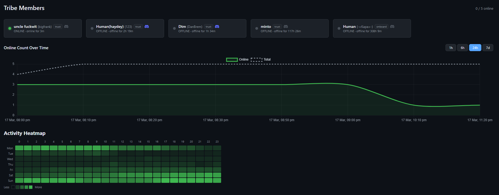
</p>

- **Real-time online/offline status** with member cards showing "online for 3m" or "offline for 2h 19m"
- **Online count over time** — area chart showing how many members were online at any point (1h, 6h, 24h, 7d ranges)
- **Activity heatmap** — GitHub-style hour x day-of-week grid showing when your tribe is most active
- **Per-member detail** — click any member for their individual heatmap, session history, total online time, and stats
- **Discord ID linking** — associate members with their Discord accounts for personal `@mention` pings on events that involve them
- **Display name overrides** — set custom display names separate from in-game names
- **Automatic stale cleanup** — members not seen in the tribe window for an extended period are automatically removed

---

## Server Activity & Blacklist

Track every non-tribemate who joins your server. Know who's been sniffing around, and get instant alerts when blacklisted players show up.

<p align="center">
  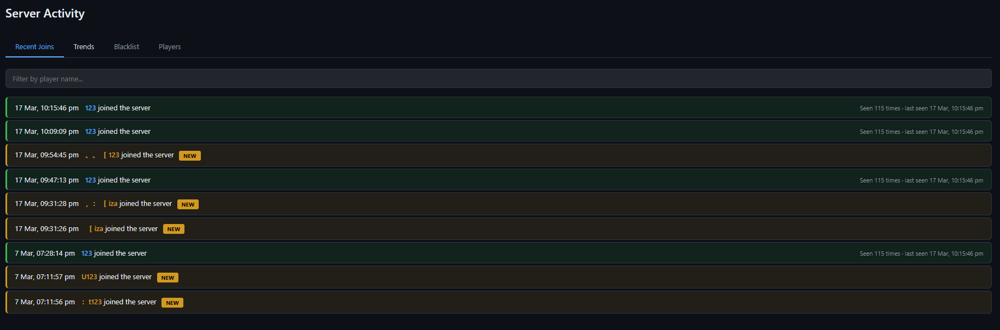
</p>

- **Recent joins** with timestamps, "NEW" badges for first-time visitors, and join frequency ("Seen 115 times")
- **Trends** — joins per hour/day charts showing server activity patterns
- **Blacklist** — add known griefers/enemies with notes. Fuzzy name matching catches OCR variations. Instant Discord alert when a blacklisted player joins
- **Player merge** — OCR sometimes garbles names differently between reads. Merge duplicate entries ("TheFormula" and "[k TheFormula") so all joins resolve to one identity
- **Player search** — filter the join feed by player name

---

## Generator Fuel Tracking

Never lose a base to an empty generator again. Register your generators, set their fuel duration, and get escalating Discord alerts as they run low.

<p align="center">
  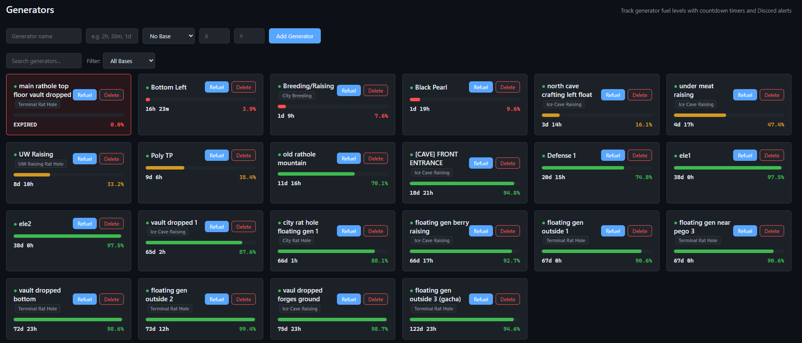
</p>

<p align="center">
  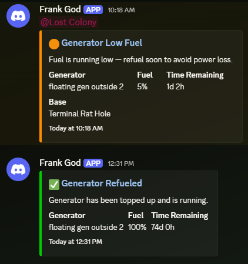
</p>

- **Live countdown bars** — color-coded fuel percentage (green → yellow → orange → red → expired)
- **Escalating Discord alerts** at 10%, 5%, 2%, and 0% fuel remaining
- **Refuel recovery** — green "Generator Refueled" embed when you top one up from the dashboard
- **Base grouping** — link generators to named bases, filter by base
- **Time remaining** — "38d 0h" at a glance, or "EXPIRED 0.0%" when it's too late
- **One-click refuel/delete** from the web UI

---

## Bases

Organize your generators and structures by named base locations.

<p align="center">
  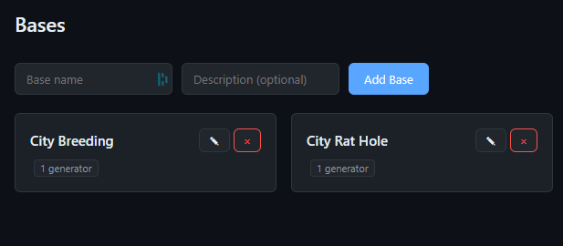
</p>

---

## Todo Lists

Per-tribe task management for organizing everything your tribe needs to get done — farming runs, taming goals, base improvements, boss prep.

<p align="center">
  
</p>

- **Lists/goals** — organize tasks into groups ("Boss Prep", "Continuous Raising", "New base location")
- **Quantity tracking** — "Greater Aberrant Sigil 55/150", "Manas 0/6"
- **Categories** — tag items (e.g. "breeding") for filtering
- **Priority levels** — low, medium, high, critical
- **Multi-assignee** — assign tasks to tribe members by Discord ID
- **Due dates** — set deadlines, see overdue counts
- **Recurrence** — daily/weekly/monthly recurring tasks that auto-reset
- **Stats dashboard** — total, active, overdue, done at a glance
- **Discord notifications** — alerts when tasks are assigned or completed
- **Filters** — by priority, category, list, assignee, status (pending/in progress/completed)

---

## Calendar

Schedule tribe events — boss fights, breeding sessions, farming runs, PvP raids — with RSVP, reminders, and Discord integration.

<p align="center">
  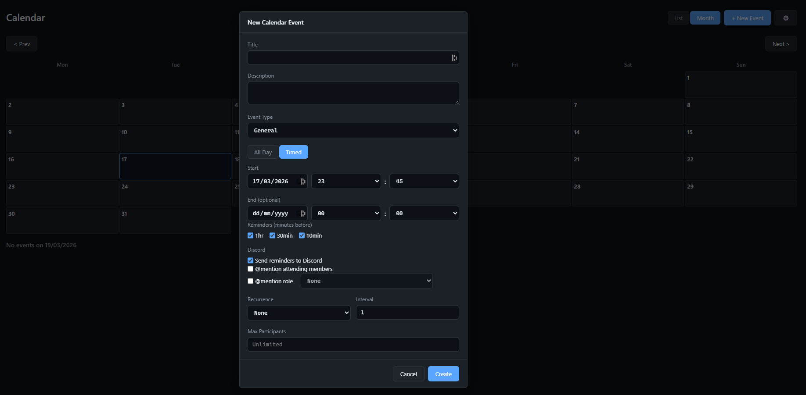
</p>

- **Month and list views** — visual calendar grid or chronological list
- **Event types** — general, boss fight, farming, breeding, PvP, custom
- **All-day or timed events** with start/end times
- **RSVP** — going / interested / not going, with max participant limits
- **Discord reminders** — configurable alerts at 1hr, 30min, 10min before the event
- **Mention options** — `@mention` attending members or a role when reminders fire
- **Recurrence** — daily, weekly, monthly with configurable intervals
- **Server search** — search official/unofficial ARK servers by name when creating events (EOS integration)

---

## Alert Rules

Every single event type is fully configurable — you control exactly what gets sent to Discord, who gets pinged, and under what conditions. This is where TribeWatch really shines over simple "forward everything" bots.

<p align="center">
  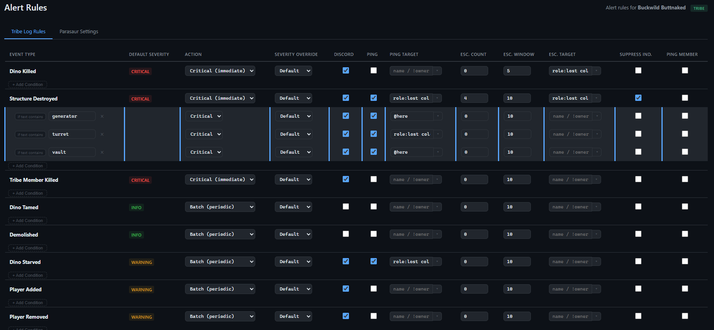
</p>

- **Per-event-type action** — Critical (immediate send + ping), Batch (queue and send periodically), or Ignore (suppress entirely)
- **Severity override** — force an event type to a different severity level than the default
- **Discord and ping toggles** — independently control whether an event sends to Discord at all, and separately whether it pings
- **Custom ping targets** — override the global ping role per event type (e.g. `@here` for vault destruction, `role:lost col` for dino deaths, `name / !owner` for member kills)
- **Escalation thresholds** — set a count and time window per event type. For example: only fire a Structure Destroyed alert after **4 events in 10 minutes** — so a single auto-decay doesn't wake you up, but an actual raid does. The escalation alert includes a summary of all events in the window
- **Escalation ping targets** — the escalation alert can ping a different role/person than the individual event alerts
- **Suppress individual alerts** — when an escalation fires, optionally suppress the individual event alerts so your Discord isn't flooded with both the individual events AND the summary
- **Text-based conditions** — add multiple conditions per event type: "if text contains `generator`", "if text contains `turret`", "if text contains `vault`" — each with its own action, severity, ping target, and escalation settings. One "Structure Destroyed" event type can have completely different behaviour depending on what was destroyed
- **Ping member** — auto-mention the specific tribe member involved in the event (the person who died, whose dino was killed, etc.) using their linked Discord ID

---

## User & Role Management

Control who can access the dashboard and what they can see, powered by Discord OAuth.

<p align="center">
  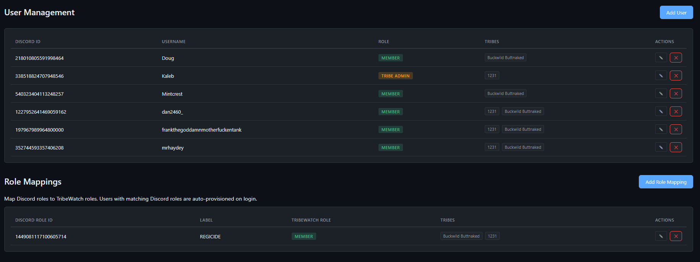
</p>

- **Discord OAuth login** — users authenticate with their Discord account
- **Role-based access** — Admin, Tribe Admin, Member roles with different permissions
- **Discord role mapping** — map your Discord server's roles to TribeWatch roles. Users with matching Discord roles are auto-provisioned on login
- **Per-tribe access** — control which tribes each user can see
- **Tribe admin delegation** — promote trusted members to manage their tribe's settings

---

## Parasaur Detection

A separate OCR region monitors the top of your screen for parasaur enemy detection notifications — the ones that flash when a parasaur detects a nearby enemy player or baby dino.

- **Player detection mode** — alert when parasaurs detect enemy players nearby
- **Babies detection mode** — 'baby' named Parasaurs alert when parasaurs detect enemy babies (breeding raids)
- **Grace period** — 30 seconds of sustained detection before promoting to a real alert (avoids noise from brief flashes)
- **"All clear" notification** — after 30 seconds of silence, sends an all-clear so you know the threat has passed
- **Per-parasaur config** — name each parasaur and set its detection mode independently, 'player' indicates it only looks for players, and same for 'baby'
- **Separate alert settings** — different Discord action/ping behavior for player vs babies detection

---

## Auto-Reconnect

TribeWatch can automatically reconnect you to ARK if you get disconnected or kicked — keeping your monitoring running 24/7 without you needing to be at your PC.

<p align="center">
  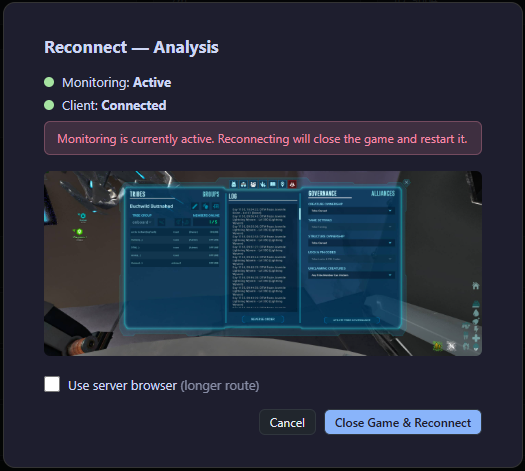
  &nbsp;&nbsp;
  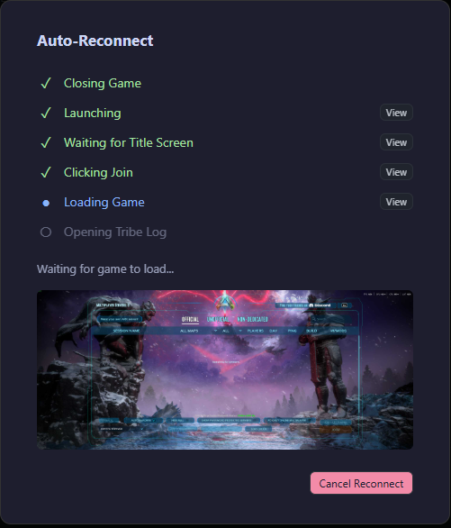
</p>

- **Detects disconnection** — monitors for the game going idle or crashing
- **Full reconnect sequence** — kills ARK, relaunches via Steam, waits for title screen, clicks "Join Last Session", waits for game to load, opens tribe log
- **Server browser fallback** — if "Join Last Session" fails, navigates the in-game server browser to find and rejoin your server by ID
- **Connection failure retry** — detects "connection failed" dialogs and retries with exponential backoff (30s initial, caps at 30 minutes)
- **Console command application** — auto-pastes ini/console commands from a script file after reconnect (INI helps with text recognition, feel free to use custom INI)
- **Progress reporting** — real-time stage updates sent to the server, viewable from the web dashboard
- **Manual or automatic trigger** — trigger reconnect from the web UI, or let it run automatically when monitoring goes idle

---

## Anti-AFK

The reconnect system doubles as anti-AFK — by periodically interacting with the game client, TribeWatch prevents ARK's AFK timeout from kicking you. Combined with auto-reconnect when this keep-alive fails, this keeps your monitoring client running indefinitely.

---

## Smart Monitoring Mode

TribeWatch knows when you're actually playing vs when you're AFK. It monitors pixel movement in the capture region — when the screen is mostly static (you're AFK with the tribe log open), it's in full monitoring mode, capturing and parsing every 2 seconds. When it detects significant screen movement (you're moving around, fighting, building), it knows you're actively playing and backs off — no point trying to OCR a tribe log that's bouncing around or not even visible.

When you go AFK again and the screen settles, TribeWatch automatically re-opens the tribe log and resumes monitoring. You don't need to manually open the log or tell TribeWatch anything — it handles the transition seamlessly. This means you can play normally, and monitoring picks back up on its own whenever you step away.

---

## Smart Deduplication

The tribe log shows the same events every time you capture a screenshot — TribeWatch uses three layers of deduplication to make sure you only get alerted once:

1. **Hash dedup** — SHA-256 of normalized event text (day + time + content). Exact duplicates are instantly caught.
2. **Fuzzy dedup** — for the same day/time, OCR might read slightly differently between frames. Fuzzy matching (>97% similarity) catches near-duplicates.
3. **Count-aware dedup** — if the tribe log genuinely shows the same event twice (e.g. two identical structures destroyed), TribeWatch tracks counts and allows real duplicates through while suppressing retransmissions.

**EOS day/time validation** — queries the official ARK matchmaking API for the real in-game day number, preventing OCR garbling (e.g. "Day 1089228" instead of "Day 1089") from poisoning the dedup state.

---

## Multi-Client / Multi-Tribe

Run multiple TribeWatch clients feeding the same server — perfect for tribes with multiple bases, multiple servers, or alliances.

- **Multiple clients per tribe** — two players can both run TribeWatch for the same tribe, providing redundancy
- **Multiple tribes on one server** — one TribeWatch server handles all your tribes across different ARK servers
- **Aggregate presence** — the server shows "Active" if any client is monitoring, "Idle" if connected but not capturing, "Offline" if all clients disconnected
- **Event buffering** — if the server goes down, clients buffer events locally and replay them when reconnected

---

## EOS Server Integration

TribeWatch queries the Epic Online Services matchmaking API for live server metadata — displayed in the dashboard header and used to harden dedup.

- **Player count** — live "Players: 5/70" from the official API (not OCR)
- **Map name** — LostColony, TheIsland, etc.
- **Game mode** — PvP / PvE
- **In-game day/time** — authoritative day number from the server, used as a sanity check for OCR day parsing
- **Server search** — search official and unofficial servers by name when creating calendar events

---

## How It Works (Architecture)

```
Your PC                          TribeWatch Server
+------------------+             +---------------------------+
|  ARK on screen   |             |  Event storage (SQLite)   |
|       |          |             |  Web dashboard (FastAPI)  |
|  TribeWatch      |   WebSocket |  Tribe member tracking    |
|  Client ---------|------------>|  Server activity logs     |
|  - Screen capture|   events +  |  Generator fuel tracking  |
|  - OCR (PaddleOCR|   heartbeat |  Todo lists & calendar    |
|  - Event parsing |             |  Alert rules engine       |
|  - Discord alerts|             |  Raid timeline clustering |
|  - Parasaur OCR  |             |  Discord notifications    |
+------------------+             +---------------------------+
```

The **client** is what runs on your gaming PC — it captures the screen, reads text with OCR, parses events, and sends Discord alerts. It also relays everything to the server.

The **server** is the brains — it stores all event history, tracks tribe members, monitors server activity, manages generators/todos/calendar, serves the web dashboard, and handles multi-client coordination. The server doesn't need the client running to use features like todo lists, calendar, or generator tracking — those work directly from the web UI.

This repo contains the **client** component. The server is hosted and managed separately.

---

## Getting Started

### Requirements

- **Windows 10/11**
- ARK: Survival Ascended
- A Discord webhook URL (for alerts)

### Install

Download from [Releases](https://github.com/frankthetank001/tribewatch-client/releases):

- **TribeWatch-Setup.exe** — installer with Start Menu shortcut, optional desktop icon, optional auto-start with Windows
- **TribeWatch-portable.zip** — extract anywhere and run `TribeWatch.exe`

Or install from source (Python 3.12+):

```bash
git clone https://github.com/frankthetank001/tribewatch-client.git
cd tribewatch-client
pip install -e .
```

### Setup

1. **Run the setup wizard**: `TribeWatch.exe --setup` (or double-click — first run auto-generates config)
2. **Calibrate screen region**: `TribeWatch.exe --calibrate` — drag to select your tribe log area (or use resolution presets for 1080p/1440p/ultrawide)
3. **Test OCR**: `TribeWatch.exe --test-ocr` — verify it reads your tribe log correctly
4. **Test Discord**: `TribeWatch.exe --test-discord` — send a test message to your webhooks
5. **Start monitoring**: double-click `TribeWatch.exe` or run with `--run`

### Resolution Presets

TribeWatch includes pre-calibrated screen capture regions for common resolutions:

- 1280x720 (720p)
- 1920x1080 (1080p)
- 2560x1080 (ultrawide)

For other resolutions, use `--calibrate` to drag-select the tribe log region, or `--calibrate-manual` to enter pixel coordinates directly.

---

## BattlEye Safety

TribeWatch is **100% BattlEye safe**. It uses standard Windows screen capture APIs (`mss` / `PIL.ImageGrab`) — the same approach as OBS, Discord overlay, or any screenshot tool. No memory reading, no DLL injection, no process hooking, no game file modification. The OCR engines (WinRT, Tesseract, PaddleOCR) process a screenshot image — they never touch the game process.

---

## License

MIT License — see [LICENSE](LICENSE).
